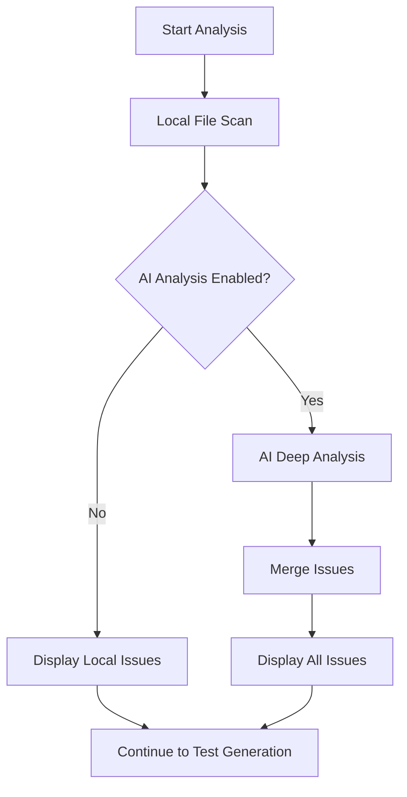

# AI-Enhanced Code Analysis Feature

## Overview

Added an **optional AI-enhanced code analysis** feature that uses AI to detect security vulnerabilities, code quality issues, and complexity problems in addition to the fast local file-based analysis.

---

## Features

### Two Analysis Modes

#### 1. **Local Analysis (Default, Always ON)**
- ⚡ **Fast**: ~1-2 seconds
- 💰 **Free**: No API costs
- 📊 **File-based**: Counts files, detects patterns
- ✅ **Detects**:
  - Missing README
  - Missing .gitignore
  - Low/moderate test coverage
  - Files without tests

#### 2. **AI-Enhanced Analysis (Optional, Toggle ON/OFF)**
- 🤖 **Intelligent**: Uses AI to understand code
- ⏱️ **Slower**: +30-60 seconds (analyzes 3 files)
- 💳 **Costs**: ~$0.03-0.10 per analysis
- 🔍 **Detects**:
  - Security vulnerabilities (SQL injection, XSS, hardcoded secrets)
  - Code smells (duplication, long functions, deep nesting)
  - Performance issues (N+1 queries, inefficient algorithms)
  - Complexity issues (cyclomatic complexity)
  - Best practice violations

---

## User Interface

### New Toggle Option

**Location**: Test Generator form

```
┌──────────────────────────────────────────────────────────────┐
│ Repository Configuration                                     │
├──────────────────────────────────────────────────────────────┤
│                                                               │
│ Repository URL: [https://github.com/...]                     │
│ Branch Name: [main]                                          │
│                                                               │
│ ☑ Generate Missing Test Cases                                │
│   Automatically generate test cases using AI                 │
│                                                               │
│ ☐ AI-Enhanced Code Analysis (Beta)                           │
│   Use AI to detect security vulnerabilities and code quality │
│   issues. Slower but more detailed (adds ~30-60 seconds)     │
│                                                               │
│ [Analyze Repository]                                         │
└──────────────────────────────────────────────────────────────┘
```

### Results Display

**With AI Analysis Enabled:**

```
┌──────────────────────────────────────────────────────────────┐
│ 🤖 AI-Enhanced Analysis: Found 4 additional issues through   │
│    deep code analysis                                        │
└──────────────────────────────────────────────────────────────┘

Code Quality Issues
┌─────────┬────────┬──────────────┬────────────────┬───────────┐
│Severity │ Source │ File         │ Issue          │Suggestion │
├─────────┼────────┼──────────────┼────────────────┼───────────┤
│ High    │   AI   │ api/auth.py  │Security: SQL   │Review and │
│         │        │              │injection risk  │fix vulner │
├─────────┼────────┼──────────────┼────────────────┼───────────┤
│ Medium  │   AI   │ utils/db.py  │Quality: N+1    │Refactor   │
│         │        │              │query detected  │to improve │
├─────────┼────────┼──────────────┼────────────────┼───────────┤
│ Medium  │ Local  │ Repository   │Low test        │Add more   │
│         │        │              │coverage (20%)  │tests      │
└─────────┴────────┴──────────────┴────────────────┴───────────┘
```

**Without AI Analysis (Default):**

```
Code Quality Issues
┌─────────┬────────┬──────────────┬────────────────┬───────────┐
│Severity │ Source │ File         │ Issue          │Suggestion │
├─────────┼────────┼──────────────┼────────────────┼───────────┤
│ Medium  │ Local  │ Repository   │Low test        │Add more   │
│         │        │              │coverage (20%)  │tests      │
└─────────┴────────┴──────────────┴────────────────┴───────────┘
```

---

## How It Works

### Workflow



### Implementation Details

#### 1. **Frontend (test-generator.html)**

Added toggle:
```html
<input type="checkbox" id="aiAnalysis">
<label>AI-Enhanced Code Analysis (Beta)</label>
<small>Use AI to detect code quality issues, security
       vulnerabilities, and complexity. Slower but more
       detailed (adds ~30-60 seconds)</small>
```

#### 2. **Frontend (test-generator.js)**

Captures toggle state:
```javascript
const aiAnalysis = document.getElementById('aiAnalysis').checked;

await fetch('/api/analyze-repo', {
    body: JSON.stringify({
        repo_url: repoUrl,
        branch_name: branchName,
        generate_tests: generateTests,
        ai_analysis: aiAnalysis  // ← New parameter
    })
});
```

#### 3. **Backend (server.py)**

**Parameter Extraction (Line 563):**
```python
ai_analysis = data.get('ai_analysis', False)
```

**AI Analysis Logic (Lines 693-824):**
```python
if ai_analysis:
    # Analyze up to 3 files without tests
    files_to_analyze = [f for f in non_test_code_files][:3]

    for file_path in files_to_analyze:
        # Read code
        code_content = f.read()

        # AI prompt
        ai_prompt = f"""Analyze this code for quality issues,
        security vulnerabilities, and complexity.

        File: {file_path.name}
        Code: {code_content[:5000]}

        Provide analysis in JSON format:
        {{
          "security_issues": [...],
          "code_quality": [...],
          "complexity": "low|medium|high",
          "suggestions": [...]
        }}
        """

        response = llm.invoke(ai_prompt)

        # Parse and add issues
        ai_quality_issues.append({
            'severity': 'High',
            'file': file_path,
            'description': f'Security: {issue}',
            'suggestion': 'Review and fix',
            'source': 'AI Analysis'  # ← Mark as AI-detected
        })
```

**Issue Merging (Line 827):**
```python
all_issues = issues + ai_quality_issues

analysis_result_before = {
    'issues': all_issues,
    'ai_analysis_enabled': ai_analysis,
    'ai_issues_found': len(ai_quality_issues)
}
```

---

## AI Analysis Details

### Files Analyzed

- **Limit**: Up to **3 files** per analysis
- **Selection**: Non-test code files without tests
- **Size**: Only first 5,000 characters analyzed (token limits)

### Analysis Categories

#### 1. **Security Issues** (Severity: High)
- SQL injection vulnerabilities
- XSS (Cross-Site Scripting) risks
- Hardcoded secrets/credentials
- Insecure cryptography
- Path traversal vulnerabilities
- Command injection risks

#### 2. **Code Quality Issues** (Severity: Medium)
- Duplicated code blocks
- Long functions (>50 lines)
- Deep nesting (>4 levels)
- Complex conditionals
- Missing error handling
- Poor naming conventions

#### 3. **Complexity Issues** (Severity: Medium)
- High cyclomatic complexity
- Too many parameters
- God objects/classes
- Spaghetti code patterns

### AI Prompt Used

```python
"""Analyze this code for quality issues, security vulnerabilities, and complexity.

File: {filename}
Code:
```
{code_content}
```

Provide a concise analysis in JSON format with this structure:
{
  "security_issues": ["issue1", "issue2"],
  "code_quality": ["quality1", "quality2"],
  "complexity": "low|medium|high",
  "suggestions": ["suggestion1", "suggestion2"]
}

Focus on:
- Security vulnerabilities (SQL injection, XSS, hardcoded secrets)
- Code smells (duplicated code, long functions, deep nesting)
- Performance issues
- Best practice violations

Be concise. Only include actual issues found."""
```

---

## Performance Comparison

### Without AI Analysis (Default)

```
Total Time: ~5-10 seconds

1. Clone repository     [2s]  ████████████
2. Local file scan      [1s]  ████
3. Detect issues        [<1s] █
4. Generate tests (opt) [10s] ████████████████████████
                              (if enabled)
```

### With AI Analysis

```
Total Time: ~35-70 seconds

1. Clone repository     [2s]  ████████████
2. Local file scan      [1s]  ████
3. AI code analysis     [30s] ████████████████████████████████████████████████████
4. Detect issues        [<1s] █
5. Generate tests (opt) [10s] ████████████████████████
                              (if enabled)
```

**Impact**: Adds ~30-60 seconds to total analysis time

---

## Cost Analysis

### API Costs

**Per Analysis:**
- **Files analyzed**: 3 files max
- **Tokens per file**: ~2,000 tokens (5,000 chars code + prompt)
- **Total tokens**: ~6,000 tokens
- **Cost**: ~$0.03-0.10 (depending on model)

**Annual Cost Estimates:**
- **10 analyses/day**: ~$300-1,000/year
- **50 analyses/day**: ~$1,500-5,000/year
- **100 analyses/day**: ~$3,000-10,000/year

### Comparison with Local Analysis

| Metric | Local Analysis | AI Analysis |
|--------|----------------|-------------|
| Cost per analysis | $0.00 | $0.03-0.10 |
| Time added | 0s | +30-60s |
| Issues detected | 3-5 (basic) | 10-20 (detailed) |
| False positives | Very low | Low-Medium |
| Accuracy | Pattern-based | Context-aware |

---

## Use Cases

### When to Use Local Analysis Only (Default)

✅ Quick repository scan
✅ Counting files and tests
✅ Basic coverage estimation
✅ Frequent analyses
✅ Cost-sensitive scenarios

### When to Enable AI Analysis

✅ Deep security audit
✅ Pre-deployment quality check
✅ Legacy code assessment
✅ Finding hidden vulnerabilities
✅ One-time comprehensive analysis

---

## Example Output

### Console Output

**With AI Analysis:**
```
Cloning repository...
Analyzing code structure...
📊 BEFORE Analysis:
   Total files: 45
   Non-test code files: 22
   Test files: 8
   Coverage: 8/22 = 36.4%

🤖 Running AI-Enhanced Analysis...
AI analyzing code quality (1/3)...
   ✓ AI analyzed: src/api/auth.py
AI analyzing code quality (2/3)...
   ✓ AI analyzed: src/utils/database.py
AI analyzing code quality (3/3)...
   ✓ AI analyzed: src/services/payment.py
🤖 AI Analysis Complete: Found 4 issues

Generating test cases...
...
Analysis complete!
```

**Without AI Analysis:**
```
Cloning repository...
Analyzing code structure...
📊 BEFORE Analysis:
   Total files: 45
   Non-test code files: 22
   Test files: 8
   Coverage: 8/22 = 36.4%

Generating test cases...
...
Analysis complete!
```

---

## Configuration

### Required Settings

**AI API Configuration (config.py):**
```python
AI_MODEL = "gpt-4"  # Or your preferred model
AI_BASE_URL = "https://api.openai.com/v1"
AI_API_KEY = "sk-..."  # Your API key
AI_TEMPERATURE = 0.3  # Lower = more consistent
```

### Feature Defaults

- **AI Analysis**: **OFF** by default (opt-in)
- **Files Analyzed**: 3 files maximum
- **Code Truncation**: 5,000 characters per file
- **Temperature**: 0.3 (more deterministic)
- **Model**: Uses same model as test generation

---

## Error Handling

### AI Analysis Failures

**Scenario 1: API Key Not Configured**
```
Issue Added:
- Severity: Low
- Description: "AI analysis enabled but API key not configured"
- Suggestion: "Configure AI_API_KEY in config.py"
```

**Scenario 2: AI API Error**
```
Issue Added:
- Severity: Low
- Description: "AI analysis failed: {error_message}"
- Suggestion: "Check AI API configuration"
```

**Scenario 3: Parse Error**
```
Console Warning:
⚠ Could not parse AI response for {filename}: {error}

(Issue skipped, analysis continues)
```

### Graceful Degradation

If AI analysis fails:
1. ✅ Local analysis still works
2. ✅ Issues still displayed (without AI issues)
3. ✅ Test generation still works
4. ✅ User sees error in issues list

**Result**: Feature failure doesn't break the tool

---

## Files Modified

| File | Changes | Purpose |
|------|---------|---------|
| [test-generator.html](static/test-generator.html#L154-L170) | Added AI Analysis toggle | UI control |
| [test-generator.js](static/test-generator.js#L43) | Pass ai_analysis parameter | Frontend logic |
| [test-generator.js](static/test-generator.js#L201-247) | Display AI issues with badge | UI rendering |
| [server.py](server.py#L563) | Extract ai_analysis parameter | Backend input |
| [server.py](server.py#L693-824) | AI analysis implementation | Core logic |
| [AI_ANALYSIS_FEATURE.md](AI_ANALYSIS_FEATURE.md) | Feature documentation | This file |

---

## Testing

### Test Scenarios

**1. AI Analysis Disabled (Default)**
```bash
# Expected:
- Fast analysis (~5-10s)
- Only local issues shown
- No AI badge in issues table
- No AI summary banner
```

**2. AI Analysis Enabled**
```bash
# Expected:
- Slower analysis (~35-70s)
- AI + Local issues shown
- AI badge for AI-detected issues
- AI summary banner: "Found X additional issues"
```

**3. AI Analysis with No API Key**
```bash
# Expected:
- Analysis completes
- Warning issue: "API key not configured"
- Only local issues detected
```

**4. AI Analysis Error**
```bash
# Expected:
- Analysis completes
- Error issue added to list
- Local analysis still works
```

---

## Future Enhancements

### Possible Improvements

1. **Configurable File Limit**
   ```python
   ai_analysis_limit = data.get('ai_file_limit', 3)
   ```

2. **Per-Language Analysis**
   ```python
   # Different prompts for different languages
   if file_ext == '.py':
       use_python_security_prompt()
   elif file_ext == '.js':
       use_javascript_security_prompt()
   ```

3. **Severity Scoring**
   ```python
   # AI provides severity scores
   {
     "issues": [
       {"description": "...", "severity_score": 8.5/10}
     ]
   }
   ```

4. **Fix Suggestions**
   ```python
   # AI provides actual code fixes
   {
     "issues": [
       {
         "description": "SQL injection",
         "fix": "Use parameterized queries: cursor.execute('SELECT * FROM users WHERE id = ?', (user_id,))"
       }
     ]
   }
   ```

5. **Caching**
   ```python
   # Cache AI results by file hash
   file_hash = hashlib.sha256(code_content.encode()).hexdigest()
   if file_hash in ai_cache:
       return ai_cache[file_hash]
   ```

---

## Summary

**Key Points:**

✅ **Optional Feature** - AI analysis is OFF by default
✅ **Hybrid Approach** - Combines fast local + slow AI analysis
✅ **User Choice** - Toggle to enable/disable per analysis
✅ **Graceful Degradation** - Failures don't break the tool
✅ **Clear Attribution** - AI issues marked with "AI" badge
✅ **Cost Awareness** - ~$0.03-0.10 per analysis
✅ **Time Awareness** - Adds ~30-60 seconds

**Best Practices:**

- Use **Local Only** for quick scans and frequent analyses
- Use **AI Analysis** for deep security audits and pre-deployment checks
- Monitor costs if running many analyses
- Review AI-detected issues manually (some may be false positives)

The feature provides flexibility: fast free analysis by default, with option to enable slower but more comprehensive AI analysis when needed.
